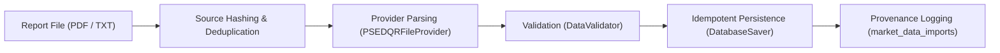

# End-of-Day (EOD) Market Data Ingestion

> [!NOTE]
> PSE Pulse operates as an independent personal application. Official PSE machine-readable market feeds are subscription products. The intended target format for Phase 2A is the official Philippine Stock Exchange (PSE) Daily Quotation Report (DQR) provided as a local PDF or text file.
> `PSEDQRFileProvider` parses the expected PSE DQR text layout using synthetic official-style fixtures. Compatibility with an actual official PSE Daily Quotation Report remains to be validated when the user supplies an authorized report file.

---

## 1. Pipeline Architecture

The EOD market data ingestion pipeline is structured around five decoupled stages:



### Key Principles

1. **Source Independence:** The provider layer produces normalized `EODQuote` Pydantic models. Any future market data source (licensed FTP, vendor REST API) can implement `EODMarketDataProvider` without modifying validation or database persistence logic.
2. **Deterministic SHA-256 Deduplication:** Every incoming file is cryptographically hashed with SHA-256. Duplicate imports of the same file are detected and rejected before modifying the database, unless explicitly overridden with `--force`.
3. **Zero-Price Prohibition:** In PSE Daily Quotation Reports, non-traded equities have missing or dashed price fields. The pipeline strictly rejects or ignores non-traded rows rather than fabricating zeroes.
4. **Idempotent Upsert:** Re-running an import for an already processed session produces zero duplicate records. Matching prices are reported as `unchanged`, amendments are reported as `updated`, and new prices are `inserted`.
5. **Production Demo-Mode Safety:** In production (`DEMO_MODE=false`), stub forecast models are bypassed to guarantee that production databases never store synthetic predictions.

---

## 2. Ingestion CLI Usage

The pipeline is executed via the `backend.pipeline.runner` CLI entrypoint:

```bash
# Dry run: parse, validate, and check against DB without committing changes
python -m backend.pipeline.runner --source-file path/to/sample_dqr.pdf --dry-run

# Ingest an official PSE DQR file and commit to database
python -m backend.pipeline.runner --source-file path/to/sample_dqr.pdf

# Ingest market data only (skip downstream forecasting)
python -m backend.pipeline.runner --source-file path/to/sample_dqr.pdf --ingest-only

# Ingest with explicit trade date verification
python -m backend.pipeline.runner --source-file path/to/sample_dqr.pdf --trade-date 2026-10-01

# Force re-ingestion of a previously imported file
python -m backend.pipeline.runner --source-file path/to/sample_dqr.pdf --force
```

### Incoming Directory Auto-Discovery

If `--source-file` is omitted, the runner automatically inspects `data/incoming/` for recently added `.pdf`, `.txt`, or `.csv` files.

---

## 3. Financial Validation Rules

`DataValidator` enforces the following constraints before any quote reaches persistence:

- **Required Fields:** `symbol`, `trade_date`, `open_price`, `high_price`, `low_price`, `close_price`, `volume`.
- **Numeric Sanity:** `open_price`, `high_price`, `low_price`, `close_price` must be strictly positive finite numbers (`> 0`). `NaN`, `+Infinity`, and `-Infinity` are rejected.
- **OHLC Price Bounds:**
  - $\text{High} \ge \max(\text{Open}, \text{Close}, \text{Low})$
  - $\text{Low} \le \min(\text{Open}, \text{Close}, \text{High})$
- **Volume & Value:** Volume must be a non-negative integer ($\ge 0$). Turnover value (if present) must be non-negative ($\ge 0$).
- **Date Consistency:** If a target date is specified, report date must match. Future trade dates are rejected.
- **Intra-batch Deduplication:** If the report file contains duplicate quotes for the same `(symbol, trade_date)`, duplicates are rejected.

---

## 4. Provenance & Audit Log Schema (`market_data_imports`)

All import events are recorded in the `market_data_imports` table:

| Column | Type | Description |
| :--- | :--- | :--- |
| `id` | Integer (PK) | Auto-incrementing primary key |
| `source_type` | VARCHAR(64) | Origin identifier (e.g. `PSE_DQR_FILE`) |
| `source_filename`| VARCHAR(255) | Name of the processed source file |
| `trade_date` | Date | Session trade date |
| `sha256` | VARCHAR(64) | SHA-256 cryptographic hash of source file |
| `imported_at` | DateTime (UTC) | Timestamp of import execution |
| `status` | VARCHAR(32) | Status: `COMPLETED`, `FAILED`, `DRY_RUN` |
| `records_seen` | Integer | Total quote rows read |
| `records_valid`| Integer | Rows passing validation |
| `records_inserted`| Integer | New `daily_prices` inserted |
| `records_updated` | Integer | Existing `daily_prices` updated |
| `records_rejected`| Integer | Rows failing validation |
| `error_message`| Text | Error traceback or failure details |

---

## 5. API Status Integration

The API endpoint `GET /api/v1/pipeline/status` includes provenance details from the most recent market data import under `last_market_data_import`, allowing frontend dashboards and health checks to monitor data freshness without manual database queries.

---

## 6. Actual PSE Report Compatibility

> [!WARNING]
> **Real-File Layout & Compatibility Notice:**
> - Current automated test suites and fixtures use synthetic files modeled on the expected PSE Daily Quotation Report text and table layout.
> - Actual official PSE PDF reports can exhibit complex multi-page pagination, wrapped security names, modified header formatting, or text extraction layout shifts depending on PDF generator versions.
> - **Operational Best Practice:** Operators should always run any new or previously unseen official PSE report with `--dry-run` first to inspect parsed symbols, prices, and validation results prior to committing to the database.
> - **Fail-Closed Safety:** In the event of an unparseable or unrecognized format, the parser fails closed (rejects rows or errors out) rather than guessing or fabricating numeric prices.
> - **No OCR Fallback:** The ingestion engine relies on standard text layer extraction via `pypdf`. Scanned or image-only PDF reports without embedded font text streams cannot be parsed and will fail closed.

---

## 7. Atomic Ingestion Transaction Contract

To protect market data integrity, PSE Pulse enforces strict atomicity across quote ingestion and provenance logging:

### Transaction Boundary
- **Atomic Persistence:** Upserting tracked `DailyPrice` records and writing the corresponding `MarketDataImport` provenance audit record are bound to a **single database transaction**.
- **All-or-Nothing Persistence:** If any persistence error occurs while writing `DailyPrice` rows or writing the provenance log, the entire transaction is rolled back via `db.rollback()`. No partial price updates or unlogged price inserts are left behind.

### Failure Handling & Audit
- **Zero Partial Changes:** On any write or validation failure, exactly 0 partial or orphaned `DailyPrice` changes remain committed.
- **Operational Audit Log (`PipelineRun`):** The pipeline execution run is updated with `status = "FAILED"`, `records_ingested = 0`, and the complete exception error message. The process exits with a non-zero exit code (`1`).
- **Isolated Failure Provenance:** An isolated `MarketDataImport` audit entry with `status = "FAILED"` is recorded in an independent transaction to capture the error diagnosis, file SHA-256, and rejection metrics without touching price tables.
- **Retry Preservation:** Because duplicate file protection filters exclusively by `status = "COMPLETED"`, a recorded `FAILED` import never prevents a subsequent retry of the same file.

### All-or-Nothing Tracked Equities Validation
- In an EOD session, if any quote record belonging to an **active tracked company** (`Company.is_active == True`) fails financial validation (e.g. invalid OHLC, zero/negative price, NaN/Inf), the entire session is aborted immediately before any database writes.
- Invalid records for untracked equities are counted as `records_rejected` and discarded without aborting the session for valid tracked securities.

---

## 8. Historical OHLCV Bootstrap Pipeline (Phase 2B & 2B.2)

In addition to daily EOD reports, PSE Pulse supports an atomic historical bootstrap pipeline capable of importing 2020–2026 historical daily OHLCV datasets from the official research repository with fail-closed provenance verification.

### 8.1 Fail-Closed Provenance Verification Gates

Before reading or staging any historical records into the database, `OfficialSourceVerifier` enforces four mandatory integrity gates:

1. **Repository Root & Canonical Path Gate:** The input directory must resolve strictly to the root of a valid Git repository (`git rev-parse --show-toplevel`), and the raw data directory must reside at canonical location `<source_root>/backend/data/raw`. Arbitrary caller directories are rejected.
2. **Git Commit Gate:** The checked-out Git HEAD (`git rev-parse HEAD`) must match the exact pinned official commit (`b8bf39f8e94729687c2e877dc164ea8a4f69e2b1`).
3. **Clean Worktree Gate:** The source repository working tree must be completely clean (`git status --porcelain=v1` must return empty output). Any modified, untracked, or staged files cause immediate failure.
4. **Committed Manifest & SHA-256 Gate:** The destination project's committed manifest (`backend/bootstrap-manifests/official_repo_b8bf39f_manifest.json`) is validated for commit parity, repository URL parity, and exactly 15 canonical symbols. All 15 source raw CSV files must match the authoritative SHA-256 hashes and row counts recorded in the manifest.

Database provenance is fail-closed and cannot be stamped without satisfying all four gates.

### 8.2 CLI Usage

```bash
# Dry run: verify source provenance and simulate bootstrap without writing to DB
python -m backend.pipeline.runner --bootstrap-source-root /path/to/official/source --dry-run

# Execute atomic all-or-nothing historical bootstrap across all 15 symbols
python -m backend.pipeline.runner --bootstrap-source-root /path/to/official/source

# Direct invocation of bootstrap CLI module
python -m backend.pipeline.bootstrap.cli --source-root /path/to/official/source --dry-run
```

### 8.3 Architectural Guarantees

1. **Pre-Verification Before Database Connection:** The source repository is validated in memory and checked against Git metadata and file hashes before opening any transaction or modifying company/sector tables.
2. **All-or-Nothing Transaction:** The bootstrap service loads, parses, and validates all 15 symbols before writing to the database. Insertion is wrapped in a single database transaction; any validation failure or pricing conflict rolls back the entire universe.
3. **Conflict Detection (`HistoricalPriceConflictError`):** If an existing `daily_prices` record for any `(company_id, trade_date)` has conflicting OHLCV values compared to the bootstrap file, the pipeline aborts immediately to avoid silent data overwrites.
4. **Idempotency:** Re-executing against an already populated database reports `0 inserted, 0 updated, 24,735 unchanged` and creates zero duplicate rows.
5. **Exact Fractional Volume Fidelity:** Eliminates all rounding by migrating `daily_prices.volume` to `Numeric(20, 4)` via Alembic revision `0004_change_daily_price_volume_to_numeric`. All 28 fractional banking volume records are preserved with 100% precision directly from source Decimal representations.
6. **Alembic 0003 Provenance Tracking:** Each company's import is logged in `market_data_imports` with `source_type="OFFICIAL_REPO_BOOTSTRAP"`, `source_repository`, `source_commit`, `source_path`, `symbol`, `sha256`, `first_trade_date`, `last_trade_date`, and `records_unchanged` stamped directly from the verified source container.
